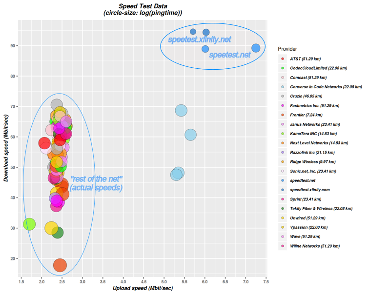

# Internet speed data - my Comcast experience

This repository [github.com://arielf/speedtests](https://github.com/arielf/speedtests) contains data about internet-speeds plus code allowing anyone to reproduce the results.

## Summary

See [README.md](README.md)

Using the code and instructions above on Ubuntu Linux or similar, anyone can repeat my experiment. I encourage readers to download and share their results so we have a larger sample. Please share what is the speed Comcast (or any other ISP) says you're getting, vs what you actually get in this experiment.

## Empirical speed-data chart

## My recent experience with Comcast

- I used to be generally happy with Comcast service, except for the fact they have no real competition (on speeds) where I live.
- In the past, I used to see consistent speeds between Comcast speedtest sites and other independent speedtest site in the Bay Area. I was seeing ~90Mbps down and 5.5Mbps up pretty consistently, regardless of which speed-test service I used.
- In Oct 2018, Comcast raised my bill from $64.95/month, to $81.95/month (a 26% hike). When I objected to the price hike, their rep told me I'm on a 'extreme' plan, giving me "up to 150Mbs" down. Since I've never seen this speed from Comcast, not even vs their own speed-test, I objected to the price hike saying all I ask of them is to leave the price and service as-is ($64.95/month for ~90Mbps down). Once I complained, they cancelled the price hike. Service remained good for a while.
- In Sep 2019, I got an email from Comcast saying (quote): ***"The download speed included with your current Xfinity Internet plan has been increased from 150/5 Mbps to 175/5 Mbps. We know how important your network is to you, and we want to thank you for choosing us to be your trusted Internet provider."***
- In reality, nothing changed...  I was still seeing the usual ~90Mbps down, so I was happy.
- A few weeks later, I noticed a significant service degradation. When I checked the Comcast site, I saw that something changed in the Comcast system. My plan became "Up to 75Mbps". Rather than staying at ~90 Mbps as it has been for years, The speeds I get went sharply down, and are now much less than the claimed "75Mbps".
- In essence Comcast is forcing me to pay them more by throttling my speeds down. If I want my old speed back, I will have to pony-up and explicitly ask Comcast for a higher speed.
- All the Comcast (Xfinity) published higher-plans include additional services. Double-play adds cable-TV, triple-play adds cable-TV and phone. I'm not interested in these services. How can I pay fair price for what Comcast gave me, pure-internet access at reasonable speeds, for many years without their forcing me into more services and higher price?
- This is what prompted me to publish my story.

## Update 2020-03-22

I have upgraded my home network to 1-Gbps speeds (Modem, router, switches) _and_ upgraded my Comcast plan by two tiers up (aka the "Performance Pro" tier).

The good news is that I now see higher down-speeds and greater consistency across sites. The bad news is that upload speeds have not budged and are still an abysmal 2.5Mbps.

## Bottom line

_In reality, the speed claimed by Comcast is *not representative of real average speeds* I experience._

_The service levels at lower-tiers, are *significantly worse* when accessing most or even all parts of the internet (except Comcast dedicated and misleading speedtest sites)_

_Even after upgrading the plan by two tiers, The biggest pain is Upload speeds. They are abysmal. Over 50% slower than what they used to be in the past at the lowest basic tier._

_Comcast is throttling speeds down in order to push customers to higher-priced plans_

## References:

- [A similar experience by another Comcast subscriber on xfinity forums](https://forums.xfinity.com/t5/Your-Home-Network/Proof-Comcast-Throttling-Internet-Speeds/td-p/3056103)
- [And a related one on Reddit](https://www.reddit.com/r/Comcast/comments/flz5ow/anyone_else_notice_pages_take_forever_to_load/)

